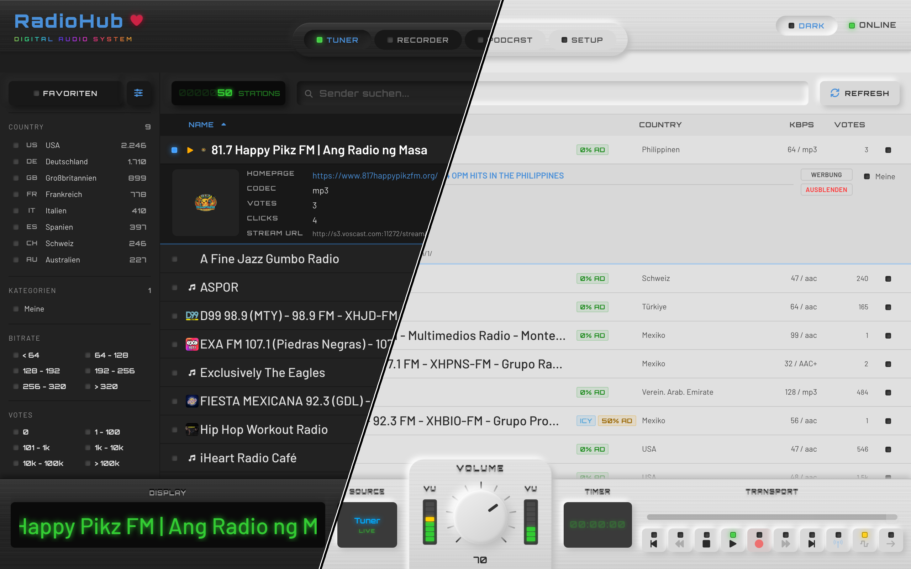
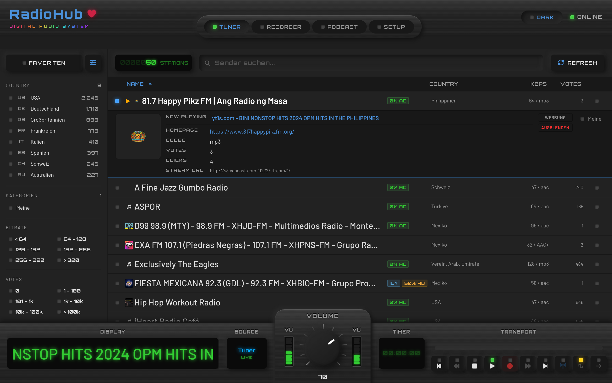
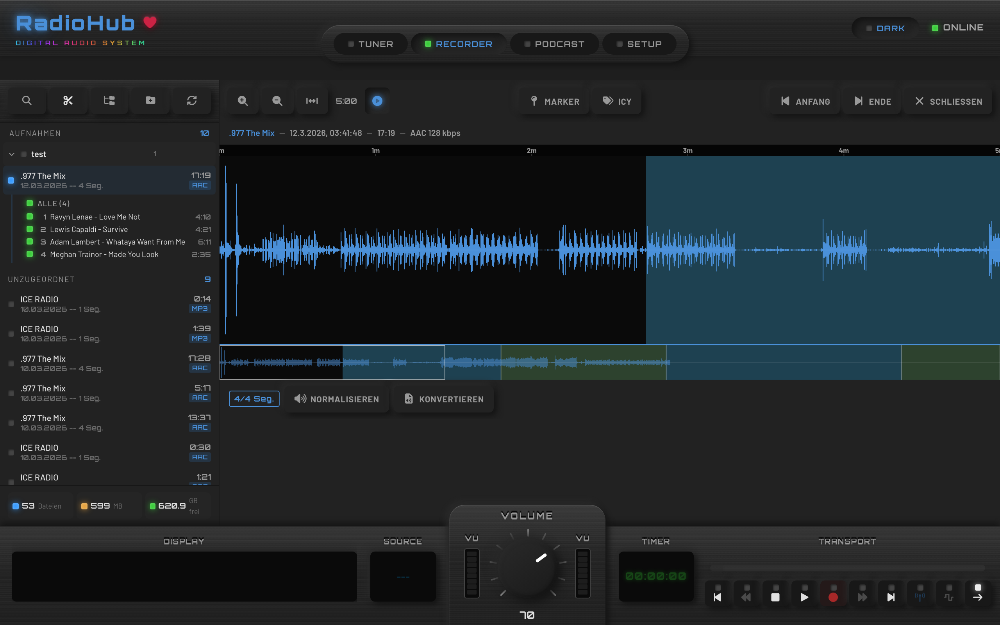
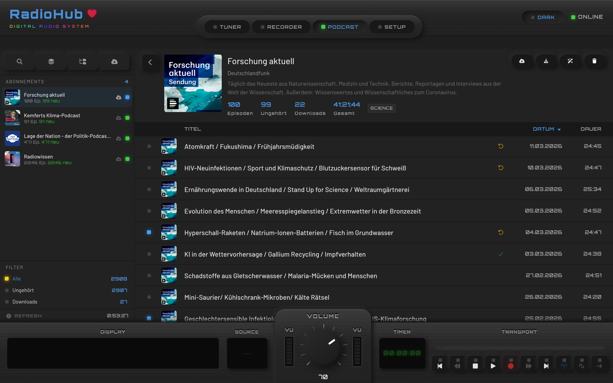
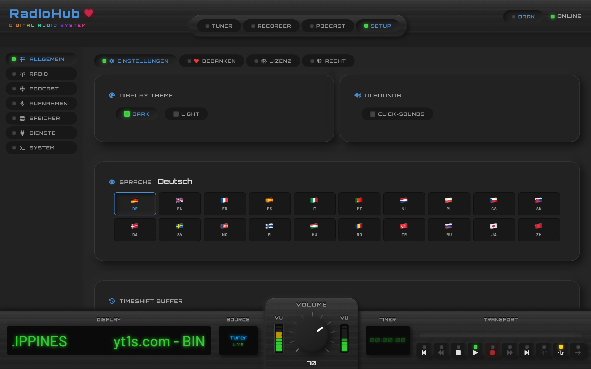
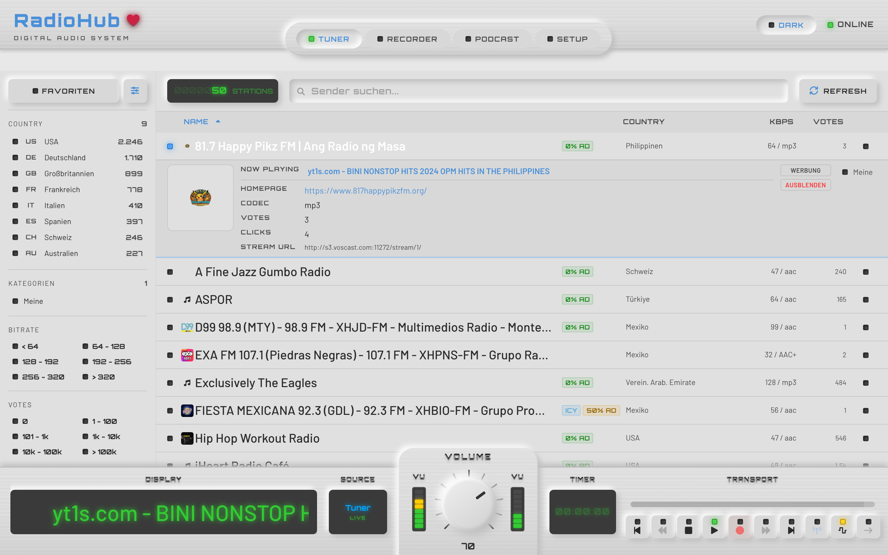

# RadioHub - Digital Audio System

Webbasiertes Internetradio, Podcast-Player und Audiorecorder mit HiFi-Optik.
Konzipiert fuer Raspberry Pi, laeuft aber auf jedem System mit Python und Node.js.



---

## Features

### Tuner - Internetradio

Zugriff auf tausende Sender weltweit ueber die Radio-Browser-API.
Filterbar nach Land, Bitrate, Codec und Votes. Favoritenverwaltung inklusive.



- Sendersuche mit Echtzeit-Filter und Sortierung
- Länderliste mit Senderanzahl
- Favoritensystem mit Drag-and-Drop-Sortierung
- Sender-Details: Homepage, Codec, Bitrate, Stream-URL
- Favicon-Caching fuer schnelle Darstellung
- Laufschrift mit aktuellem Titel (ICY-Metadata)

### Recorder - Aufnahmen

Laufende Streams mitschneiden, segmentieren und bearbeiten.
Integrierter Waveform-Cutter fuer praezises Schneiden.



- Zeitgesteuerte und manuelle Aufnahme
- Waveform-basierter Audio-Cutter mit Minimap
- Segment-Schnitt per Doppelklick oder Tastatur
- Normalisierung (LUFS) und Format-Konvertierung (MP3, FLAC, OGG, WAV)
- Datei-Explorer mit Sortierung und Segment-Selektion

### Podcasts

RSS-Feeds abonnieren, Episoden streamen oder herunterladen.



- Podcast-Suche und Abonnement-Verwaltung
- Episoden-Filter: Alle, Ungehoert, Downloads
- Streaming und Offline-Downloads
- Automatische Feed-Aktualisierung

### Setup

Umfangreiche Einstellungen fuer Darstellung, Sprache und System.



- Dark Mode und Light Mode
- 20+ Sprachen mit Flaggen-Auswahl
- Aufnahme-Einstellungen (Format, Qualitaet, Speicherpfad)
- Timeshift-Buffer-Konfiguration
- System-Informationen und Dienste-Verwaltung

### HiFi-Player

Der Player orientiert sich an klassischer HiFi-Geraete-Optik:

- Gebuerstetes Edelstahl-Design (Brushed Metal)
- VU-Meter mit Echtzeit-Pegelanzeige
- Transport-Buttons im Hardware-Look
- Drehregler fuer Lautstaerke
- LED-Anzeigen fuer Status und Navigation
- Laufschrift-Display mit Stream-Titel
- Tastatursteuerung (Space, Pfeiltasten, 1-4 fuer Tabs)

### Light Mode

Alle Oberflaechen sind auch im hellen Design verfuegbar.



---

## Technik

| Komponente | Technologie |
|------------|-------------|
| Frontend | Svelte 5 (Runes), Vite, hls.js |
| Backend | Python, FastAPI, FFmpeg |
| Audio | HLS-Streaming, ICY-Metadata, LUFS-Normalisierung |
| Datenbank | SQLite |
| Icons | Font Awesome 6 |
| Fonts | Orbitron (Logo), Barlow (UI) |

### Architektur

```
radiohub-frontend/    Svelte 5 SPA (Port 5180)
radiohub-backend/     FastAPI REST-API (Port 9091)
  backend/
    routers/          API-Endpunkte
    services/         Business-Logik, Audio-Verarbeitung
    database.py       SQLite-Anbindung
```

### Voraussetzungen

- Python 3.11+
- Node.js 18+
- FFmpeg

### Installation

```bash
# Backend
cd radiohub-backend
python -m venv .venv
source .venv/bin/activate
pip install -r requirements.txt

# Frontend
cd radiohub-frontend
npm install
```

### Starten

```bash
# Backend (Port 9091)
cd radiohub-backend
source .venv/bin/activate
uvicorn backend.main:app --host 0.0.0.0 --port 9091 --reload

# Frontend (Port 5180)
cd radiohub-frontend
npm run dev
```

Die App ist dann unter `http://localhost:5180` erreichbar.

---

## Lizenz

Privates Projekt. Alle Rechte vorbehalten.
